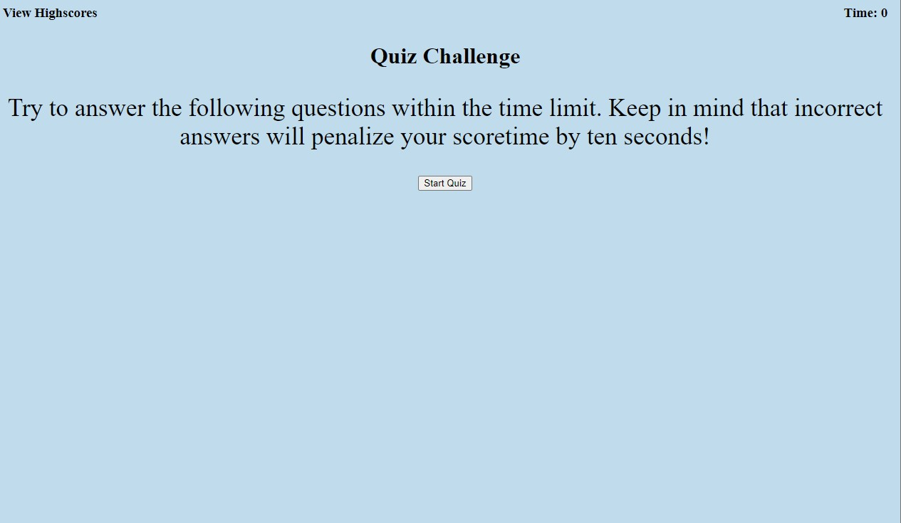
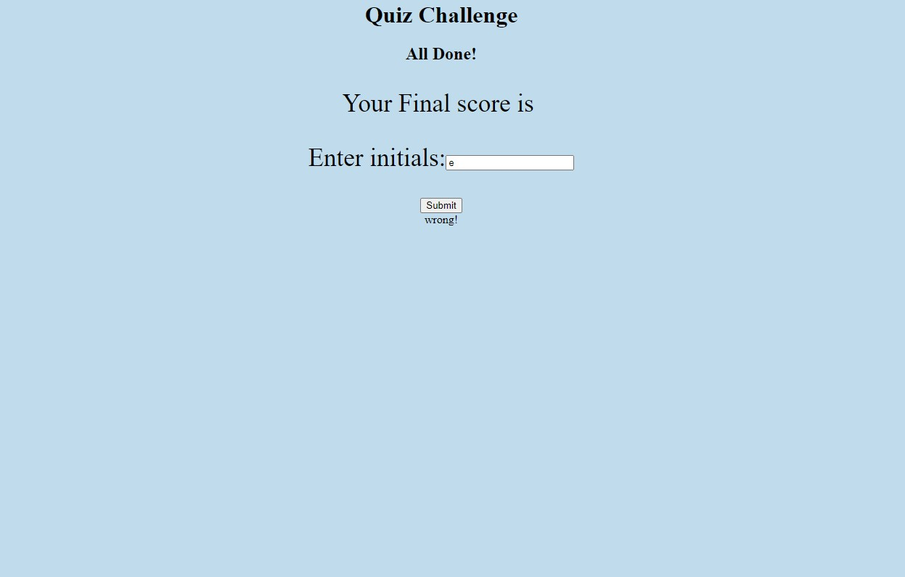
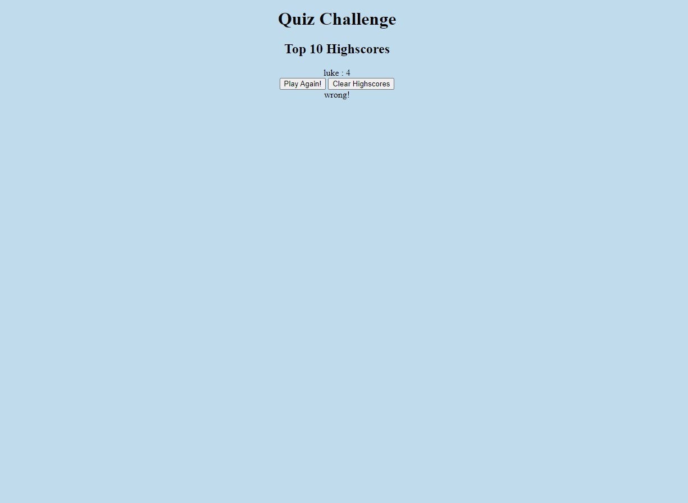

# ** Quiz Me ** 

## Description
For a person who want to quiz themselves on JS, CSS, and HTML

  ## Table of Contents
  - [Installation](#installation)
  - [Usage](#usage)
  - [Credits](#credits)
  - [License](#license)
  - [Tests](#tests)
  - [Questions](#questions)

## Installation
    steps to initialize webpage

-first download the repo from github to local machine

-then open html file on visual studios

-then open right click and copy path then paste into a browser and press enter

  ## Usage
  Press Start Quiz then answer the questions to the best of your knowledge, the score is gonna be the remaining time left and each time you get a question wrong 10 seconds will be taken off of the timer.  You can save the score at the end of your quiz with your initials.  and you can clear the leaderboard at the end if you are so inclined

  
  
  

   ## Credits

     ## License
    The license this application is covered under is MIT
    You can find more information on the license at https://choosealicense.com/licenses/mit/

 ## Tests
  n/a

    ---
  ## Questions
  https://github.com/ejasato

  eric.j.asato@gmail.com
